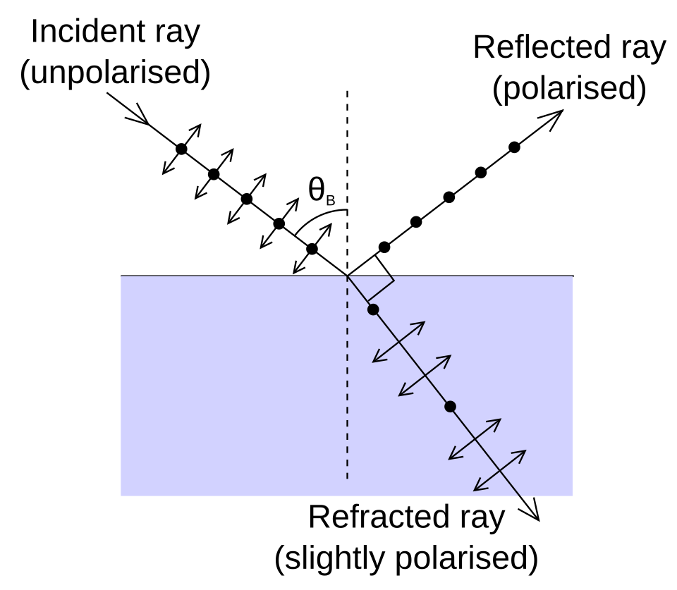

# Physics Summary

# Themology

### Particle energy
Only related to temperature.
Inner energy is composed of translation kinematic energy and vibration energy.
$$
U_particle = \frac{dof}{2} k T
$$
$$
k N_A = R
$$
$$
\partial Q = \partial U + P\partial V
$$
$$
\begin{align}
\sqrt{\bar{v^2}} = \sqrt{\frac{3kT}{m}} \\
\sqrt{\bar{v}} = \sqrt{\frac{8kT}{\pi m}}\\
v_p = \sqrt{\frac{2kT}{m}}
\end{align}
$$

### Isochoric
$$
\partial Q = \frac{i}{2} R\partial T
$$

### Isobaric $\partial P = 0$
$$
\begin{cases}
\partial Q = \frac{i}{2} R\partial T + P\partial V \\
PV = RT
\end{cases} 
$$

### Adiabatic $\partial Q = 0$
$$
\begin{cases}
\partial Q = \frac{i}{2}R \partial T + P\partial V \\
P = \frac{RT}{V} \\
\Rightarrow \frac{\partial T}{T} + \frac{(\gamma - 1) \partial V}{V} = 0
\end{cases}
$$

Then we have
$$
\begin{align}
TV^{\gamma - 1} &= const \\
PV^{\gamma} &= constant, \\ \gamma &= \frac{C_{P}}{C_V}
\end{align}
$$

### Carnot Circulation
Carnot circulation is inversable, so we can use Entropy to get its efficiency.
$$
\eta = 1 - \frac{Q_l}{Q_h}
$$
And we also have heat pump and cooler:
$$
\begin{align}
\eta_{pump} = \frac{Q_H}{Q_H - Q_L}
\eta_{cooler} = \frac{Q_L}{Q_H- Q_L}
\end{align}
$$
>[!note] efficient > 1?
>That's right. Cus our definition is "Useful / work". So sometimes we don't pay too much work and get good results.

# Simple Harmonic Vibration.
$$
A_0 \cos (\omega t + \phi_0)
$$

- with damper:
Here $f = -\gamma \dot{x}$
$$
\begin{align}
def: \beta = \frac{\gamma}{2m}
\begin{cases}
y &= e^{-\beta t}(C_1 e^{\sqrt{\beta^2 - \omega^2}t} + C_2 e^{\sqrt{\beta^2-\omega^2}t}), &\beta > \omega \\
y &= e^{-\beta t}(C_1 + C_2t), &\beta = \omega \\
y &= e^{-\beta t}A_0 \cos(\sqrt{\omega^2 - \beta^2}t + \phi_0),& \beta < \omega \\
\end{cases}
\end{align}
$$

- with outer force

### beat
Same Intensity, same frequency, small phase difference.

# Machanical Waves
### Waving Function on Plane
$$
\frac{\partial ^2y}{\partial x ^2} = \frac{1}{u^2}\frac{\partial^2 y}{\partial t^2}
$$
### Energy Properties: density and stream
$$
\begin{align}
\bar{\omega} &= \frac{1}{2} \rho A^2 \omega^2 \\
I &= \bar{\omega}u
\end{align} 
$$

### Standing Wave
$$
\frac{\lambda}{2}
$$

# Optical
### Double Crack Interference
### Grating Scattering
missing levels are related to itself. Not so to the light. When solving these problems, finish missing levels first.
$$
Resolution=\frac{\lambda}{\Delta\lambda} = k N
$$
### Brewster Angle
When the reflection ray and fraction ray become orthogonal.
The reflecting one become complete bias vibrating. (??)

### Double Fraction
o, e
# Quantum Mechanics

- Black Body
$$
M_0(T) = \sigma T^4 
$$
$$
T\lambda_m = b
$$

- Compton Scattering
$$
\begin{align}
\Delta\lambda&=\frac{h}{mc}(1-\cos\theta)\\
\Delta \lambda &=\frac{2h}{m_0 c} \sin^2 (\frac{\phi}{2})
\end{align}
$$

- Material Waves
$$
\lambda = \frac{h}{p}= \frac{h}{m_0c}\sqrt{1 - \frac{v^2}{c^2}}
$$
$$
\Delta P\Delta x = \frac{\hbar}{2}
$$
### Schodinger Wave Function
  - one dim well
$$
\sqrt{\frac{1}{a}}\sin(\frac {n\pi x}{a})
$$
$$
E=\frac{n^2\pi^2\hbar^2}{2ma^2}, n = 1, 2, 3 ...
$$
### Hydrogen Spectrums
$$
\frac{1}{\lambda} = R (\frac{1}{n_l^2} - \frac{1}{n_h^2})
$$
	- Lyman, Balmer, Paschen...
- Electrons Status
	- Energy level of atom, just like average radius to core.
$$
E_n = \frac{-13.6 eV}{n^2}
$$
	- rotation symmetric, spdfg
$$
L = \sqrt{(l+1)l} \hbar, l = 0, 1, ..., n-1
$$
	- the projection of angular momentum on one axis 
$$
L_z = m_z \hbar, m_z = \pm l
$$
	- DOF of electronds in quantum dimension. This is spin angular momentum.
		- The spin quantum number s is 1/2 while the spin magenetic quantum number is +- 1/2
$$
S = \frac{\sqrt{3}}{2} \hbar 
$$
	- this is the projection of spin am when there is an outer magnetic field. 
$$
S_z = m_s \hbar, m_s = \pm\frac{1}{2}
$$
